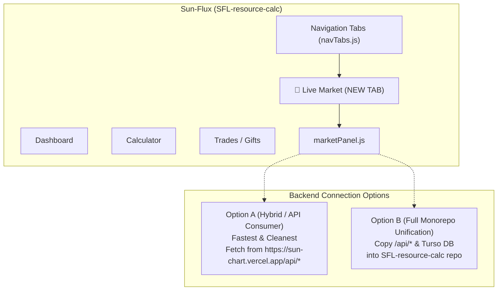

# Implementation Plan: Migrating SunChart into Sun-Flux (Resource Tracker) as a Tab

## Goal Description
You are exploring integrating **SunChart (Price Tracker & Interactive Graphs)** directly into your main application **Sun-Flux (`Kuro-txt/SFL-resource-calc`)** as a first-class navigation tab (e.g., `🌻 Market / Charts`).

This would consolidate your SFL tools into a single, unified web app where farmers can calculate resource yields, track crops, gifts, wishlist, and **check live market floor prices & 30-day price trends in one place**.

---

## High-Level Architecture Options



---

## Recommended Strategy: Native Panel with Hybrid Backend (Option A)

> [!TIP]
> **Why Option A is the cleanest way to start:**
> You keep `sun-chart.vercel.app` running its 15-minute cron job and Turso database without touching its backend. `SFL-resource-calc` simply fetches from `https://sun-chart.vercel.app/api/market` and `/api/history` (CORS is already enabled with `Access-Control-Allow-Origin: *`).
> * **Zero risk** to your existing database or cron setup.
> * If you later want full single-repo unification, you can easily copy the `/api` folder into `SFL-resource-calc`.

---

## Detailed Step-by-Step Migration Breakdown

### 1. Frontend Integration in `SFL-resource-calc`

#### A. Add Mount Section in [`index.html`](file:///C:/Users/anubh/.gemini/antigravity/brain/d90c6db5-ca57-4e8c-96e5-d40375eaebb4/scratch/sfl-tracker/index.html)
Add a dedicated container alongside the existing views:
```html
<!-- Inside #main-app-container .sfl-panel -->
<div id="dashboard-section"></div>
<div id="calc-section" class="hidden"></div>
<div id="trade-history-section" class="hidden"></div>
<div id="npc-gifts-section" class="hidden"></div>
<div id="wishlist-section" class="hidden"></div>

<!-- NEW: Market Prices & Charts Section -->
<div id="market-section" class="hidden space-y-4"></div>
```

#### B. Include Chart.js in `index.html` <head>
```html
<script src="https://cdn.jsdelivr.net/npm/chart.js@4.4.1/dist/chart.umd.min.js"></script>
```

#### C. Add Tab in `src/components/navTabs.js`
Add the new tab definition:
```javascript
{
  id: 'market',
  label: 'Market Trends',
  icon: 'fa-chart-line', // or sunflower emoji
  sectionId: 'market-section'
}
```

#### D. Create Panel Component `src/panels/marketPanel.js`
Port the UI from SunChart into a modular panel:
* **Sub-views**:
  1. **12H / 24H Movers list** (Gainers & Losers with count badges and pulse dots).
  2. **Search & Catalog selector** (all 65 crops, minerals, exotic collectibles).
  3. **Interactive Chart View** (Range pills: `6h`, `12h`, `24h`, `7d`, `30d`, `90d`, `all`).
  4. **Stack Calculator / Plaza Tax tool** (adapted to calculate quick trade values).

---

### 2. Styling & Theme Harmonization

SunChart and Sun-Flux share very similar Tailwind color aesthetics, making visual unification straightforward:

| Component | SunChart Style | Adapted to Sun-Flux (`tailwind.config`) |
| :--- | :--- | :--- |
| **Containers** | `.glass-panel` | `.sfl-panel` / `bg-sfl-card border-sfl-cardBorder` |
| **Fonts** | Inter / Mono | `font-game` (Fredoka) + `font-mono` for numbers |
| **Accents** | Amber / Emerald / Rose | `text-sfl-gold`, `text-emerald-500`, `text-rose-500` |
| **Dark Mode** | `dark:bg-black/40` | Native `dark` class matching Sun-Flux dark theme |

---

### 3. Cross-Tab Superpowers (Data Synergy)

Migrating the price tracker into Sun-Flux unlocks powerful synergies that aren't possible when they are separate websites:

1. **Auto-Fill Live Market Prices in Calculator**:
   * When calculating crop or resource profit in Sun-Flux's `calculatorPanel.js`, users currently have to enter prices manually.
   * With the market data loaded, you can add an **"Use Live Market Price"** button that automatically fetches the floor price from the market cache!
2. **Wishlist Floor Tracking**:
   * In `wishlistPanel.js`, items on the user's wishlist can show live SFL market floor prices and 24h trend arrows.
3. **Trade History Valuation**:
   * In `tradeHistory`, compare past trade prices with current market floor prices to show profit/loss over time.

---

### 4. Backend & Infrastructure (If Doing Full Monorepo Migration)

If you decide to migrate the backend into `SFL-resource-calc` as well:
1. **Copy API routes**:
   * Move `api/cron.js`, `api/market.js`, `api/history.js`, and `api/lib/` into `SFL-resource-calc/api/`.
2. **Environment Variables**:
   * Add `TURSO_DATABASE_URL`, `TURSO_AUTH_TOKEN`, and `SFL_API_KEY` to Vercel environment variables for `SFL-resource-calc`.
3. **Cron Job Schedule**:
   * Update cron-job.org to ping the new URL: `https://your-resource-calc.vercel.app/api/cron`.

---

## User Review Required

> [!IMPORTANT]
> **Preferred Approach Decision:**
> 1. **Option A (API Consumer - Recommended first step)**: Sun-Flux frontend just calls `https://sun-chart.vercel.app/api/market` and `/api/history`. 
>    * Keeps backend separated and zero-maintenance.
>    * Can be built and tested in under an hour.
> 2. **Option B (Complete Monorepo Unification)**: Merge all API endpoints and Turso database credentials into `SFL-resource-calc`, eventually sunsetting the separate `Price-tracker` repository.

---

## Summary Checklist of Required Steps

- [ ] Decide between Option A (fetch from sun-chart API) vs Option B (merge backend routes).
- [ ] Add `<div id="market-section"></div>` to `SFL-resource-calc/index.html`.
- [ ] Include `Chart.js` in `index.html`.
- [ ] Add `Market Trends` tab to `src/components/navTabs.js`.
- [ ] Create `src/panels/marketPanel.js` bundling the Movers, Catalog Dropdown, and Canvas Chart.
- [ ] Adapt theme classes to match Sun-Flux's Fredoka / SFL colors.
- [ ] (Optional) Add "Use Live Market Price" button to Sun-Flux's resource calculator.
